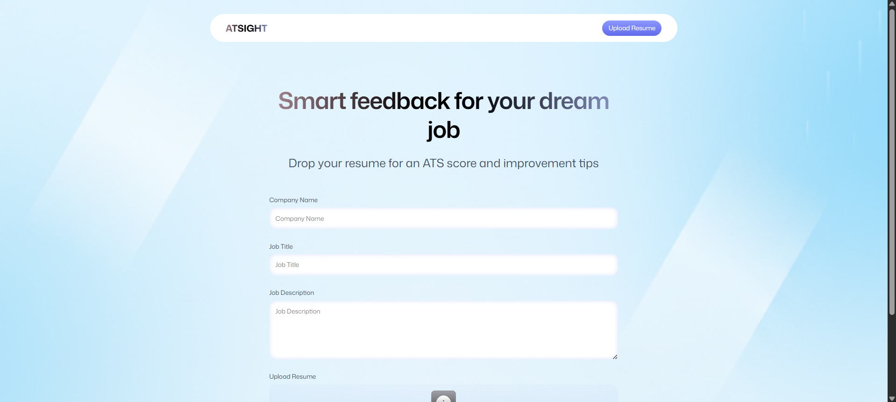
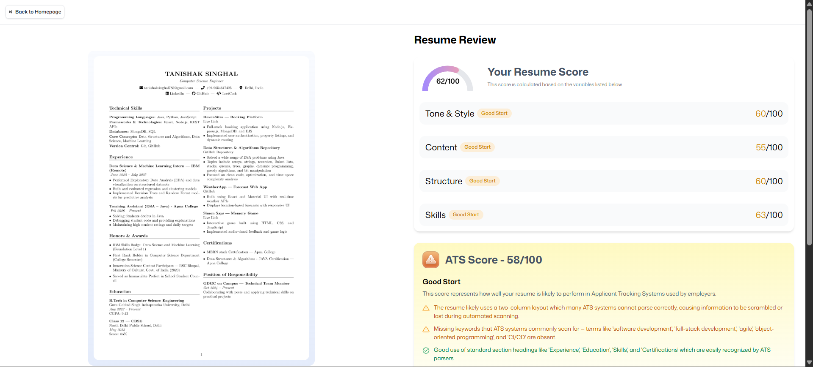

# ATSight 🚀  
### AI-Powered Resume Analyzer & ATS Scoring Tool

ATSight is a web-based application that helps users analyze their resumes against a specific **job title, job description, and company**.  
It provides **actionable feedback**, an **ATS score**, and improvement suggestions to increase the chances of getting shortlisted.

🔍 Built to simulate how modern **Applicant Tracking Systems (ATS)** evaluate resumes.

---

## 🌐 Live Demo
👉 https://atsight.vercel.app  
*(replace with your actual deployed link)*

---

## ✨ Features
- ✨ completely AI-powered
- 🎯 fully comprised with Auth 
- 📄 Upload resume (PDF)
- 🧠 AI-powered resume analysis
- 🎯 Job-specific feedback (based on title & description)
- 📊 ATS compatibility score
- ✅ Strengths & ❌ improvement suggestions
- ⚡ Fast, responsive UI
- 🌍 Deployed on Vercel

---

## 🛠️ Tech Stack

**Frontend**
- React.js
- React Router
- puter.js (for serverless backend)
- JavaScript (ES6+)
- HTML5 & CSS3

**AI / Logic**
- Resume text analysis
- Keyword & relevance scoring
- Rule-based ATS simulation

**Deployment**
- Vercel

---

## 📂 Project Structure
ATSight/
├── public/
├── src/
│ ├── components/
│ ├── pages/
│ ├── utils/
│ ├── App.js
│ └── index.js
├── build/
├── package.json
└── README.md


---
## 📸 Screenshots

### 🏠 Home Page


### 📤 Resume Upload


### 📊 Analysis & ATS Score



## 🚀 Getting Started (Local Setup)

### 1️⃣ Clone the repository
```bash
git clone https://github.com/your-username/ATSight.git
cd ATSight
```
2️⃣ Install dependencies
```bash
npm install
```
3️⃣ Run the project
```bash
npm start
```

The app will run on:

http://localhost:3000
🧪 Build for Production
```bash
npm run build
```

This generates a build/ folder used for deployment.

📈 Future Improvements

📑 Resume history tracking

🧠 Advanced NLP-based scoring

🏢 Company-specific ATS tuning

📥 Downloadable feedback reports

🤝 Contributing

Contributions are welcome!
Feel free to fork this repo and submit a pull request.

👨‍💻 Author

Tanishak Singhal

GitHub: https://github.com/TanisqSinghal

LinkedIn: https://www.linkedin.com/in/tanishak-singhal-31462a275/

⭐ If you like this project

Give it a ⭐ on GitHub — it really helps!


---


